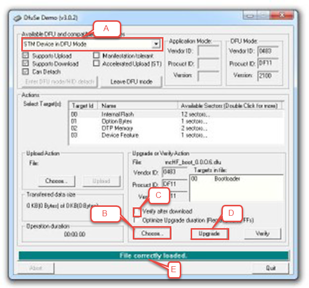

DF8OE Bootloader Usage (Bootloader 3.3.0 and newer)
===================================================

The DF8OE bootloader is responsible for starting the firmware of the TRX. It is
also used to flash new firmware AND bootloader.

Firmware can be installed via a USB drive or via USB cable using DFU Upgrade. The bootloader can only be installed via USB cable using DFU Upgrade, __not__ via USB drive.

This document describes both, upgrades via USB drive and via USB cable, each in its own section in this document. This document assumes you have a bootloader with version 3.3.0 or newer installed. If not, see information below how to upgraded older bootloaders. 
 
For firmware, the most convenient way is to use a USB drive to install new firmware with the USB drive connected to the (big) USB-A socket. 
To install a new bootloader (or new firmware) the alternate method is to run a DFU upgrade using a PC connected via USB cable to the small (Mini USB connector) and an appropriate DFU upgrade tool (e.g. Windows: DFUSe, Linux: dfu-util). 

The document describes both, upgrades via USB drive and via USB cable, each in
its own section in this document.

### Documentation For Older Bootloader Versions

This documentation is stored with the source code in the corresponding release archives ( in mchf-eclipse/useful\_docs/bootloader_doc.md) or in the github (even for not released bootloaders). So for older bootloaders, please use the Git/GitHub history function. 

## Getting The Newest Bootloader Installed
If you already have the newest bootloader installed, you can skip this section. The method to upgrade to the newest bootloader differs depending on if an bootloader at all and which bootloader is installed. See find the section matching your scenario below and follow instructions given there.

### Installing The Bootloader For The First Time On A New TRX

#### The Normal Way: P6-Jumper Method

The procedure to install any bootloader on machine without a bootloader is the same as described for the M0NKA bootloader (using DfuSeDemo/dfu-util). See [bootloader_install.pdf](bootloader_install.pdf) or [bootloader_install.odt](bootloader_install.odt) in this directory for instructions. This is the method that requires the famous P6 jumper to be closed and requires the DFU form bl-<trx_id>.dfu (e.g. bl-mchf.dfu for the mcHF). 
 
#### For ST-Link Owners: Using the Debug Connection
If you own a ST-Link and have the debug headers installed on the UI board (not available on mcHF version 0.5), you can simply flash the bl-<trx_id>.bin/bl-<trx_id>.hex/bl-<trx_id>.elf using your favorite ST flash tool at address 0x08000000. 

### Upgrading An Older UHSDR/DF8OE Bootloader or A M0NKA Bootloader  
To findout which bootloader version is installed, watch the bootscreen or go to the bootloader version in the system information menu.

#### Prior Version 2.2.3 or M0NKA bootloader installed

The procedure to upgrade an older bootloader to a version equal or above 2.2.3 is identical to the procedure for first time bootloader installation, see section above. 

#### UHSDR/DF8OE Bootloader Version 2.3.3 Or Newer But Prior 3.3.0
Basically identical to the instructions for DFU upgrade given below but slightly different LED codes and no LCD display. 
Of course, also the P6-Jumper method as described in the section above also works.

#### UHSDR/DF8OE Bootloader Version 3.3.0 Or Newer
See DFU upgrade given below. Of course, also the P6-Jumper method as described in the section above also works.

### Installing The Bootloader For The First Time On A New TRX

The procedure to install any bootloader on machine without a bootloader is the
same as described for the M0NKA bootloader (using DfuSeDemo/dfu-util). See
[bootloader_install.pdf] or [bootloader_install.odt] in this directory. This is
the method that requires the famous P6 jumper to be closed and requires the DFU
form bl-.dfu (e.g. bl-mchf.dfu for the mcHF).

The USB drive approach can be used to upgrade new firmware without any need for special software. 

### Upgrading An Older Bootloader Prior Version 2.2.3

The procedure to upgrade an older bootloader to a version equal or above 2.2.3
is identical to the procedure for first time bootloader installation, see
section above.

Firmware Update Procedures Using a USB Drive
--------------------------------------------

For the firmware-upgrade you must plug the USB-key into the TRX big USB-A plug.

### Prerequisites

1.  You need the DF8OE bootloader to be installed (once) on your TRX

2.  You need USB drive formatted with a single partition with the filesystem FAT
    or FAT32 (not exFAT, NTFS or anything else!). Normal USB pen drives
    formatted under Windows or Linux fulfill this criteria.

For the firmware-upgrade you must plug the USB-key into the TRX big USB-A plug.

### Flashing New Firmware And Saving Old Firmware

1.  Place the binary file of the new firmware with the name "fw-.bin" (e.g.
    fw-mchf.bin for the mcHF) into the root directory of the USB drive.

2.  Turn off the TRX and connect the USB drive.

3.  Press BAND- button and hold it.

4.  Then press the power button and release it after a second once you see the
    LCD screen light up.

5.  Release BAND- button once you see the green LED light up. Now the dumping of
    the whole firmware flash into MCHFOLD.BIN starts. The resulting file will
    have a size of up to 1984kByte, depending on the actual flash size of the
    MCU (2M = 1984, 1M = 960, 512k = 448).

6.  Then the red LED lights up too, indicating the write process has started.

7.  When the update has finished, the backlight goes dark, both red and green
    LEDs remain steadily on. If not, and the red LED starts flashing, see the
    error codes section below.

8.  Remove the USB drive and press BAND- to reboot into the new firmware, press
    Power to power off.

### Only Saving Old Firmware

1.  Turn off the TRX and connect the USB drive.

2.  Press BAND- button and hold it.

3.  Then press power button.

4.  Release both buttons once you see the LCD screen light up.

5.  Release BAND- button once you see the green LED light up. Now the dumping of
    the firmware into fw-.old (e.g. fw-mchf.old for the mcHF) starts.

6.  When finished, the backlight goes dark and the green LED remains steadily
    on. If not, and the red LED starts flashing, see the error codes section
    below.

7.  Remove the USB drive and press BAND- to reboot, press Power to power off

### Error Handling and Codes

#### No Valid Firmware Installed (Yet)
During normal operation of the bootloader (by just pressing the power button), a flashing backlight indicates 
that the bootloader did not identify a valid firmware in flash. This can happen either because you 
never flashed one, or the flashed binary was not a valid firmware binary for your TRX, or you erased the flash memory (e.g. 
with an external debugger tool like the ST-Link), or in the worst case, you could have a defect in the processor 
flash memory.

#### No Usable USB Drive Detected
If during firmware update mode the LCD backlight remains on with a slowly blinking green LED, your USB drive was not detected.
You can remove the USB drive and try to plug it in again, or you can try another key. Remember to follow the steps in "Flashing New Firmware and Saving Old Firmware" as shown above when plugging in the drive if you want to upgrade your firmware. Do not just press BAND- button as only the old firmware is written to your drive.

#### Bootloader is Not DF8OE Bootloader
If in firmware update mode (start with Band- pressed) right after starting the TRX you see a black screen with one or more LEDs turned on or blinking, you don't have the DF8OE bootloader but most likely the mcHF M0NKA bootloader installed. See his pages for instructions how to use it or replace the bootloader with this one. The M0NKA bootloader needs a Windows software to flash the image and it uses the small Mini-USB port.

#### Errors During the Installation Process
For the firmware update mode there are a number of error conditions reported through a visual code.
If firmware reading/writing process ends in an error this is shown by turning off the LCD backlight then
turning the green LED off, blinking the red LED in bursts, then turning the LCD backlight on and off again (green LED remains off) and repeating the red LED flash bursts. This will stop if you press Power for a little while, which turns the TRX off.
 

The red LED is flashing in bursts of:

| Flashes | Error                                       |
|---------|---------------------------------------------|
| 1       | USB problems                                |
| 2       | fw-.bin not found on the USB drive          |
| 3       | flash memory is too small for mchf.bin      |
| 4       | problems writing fw-.old to the USB drive   |
| 5       | problems reading fw-.bin from the USB drive |
| 6       | STM32F4 flash programming error             |
| 7       | STM32F4 flash erase error                   |
| 8       | STM32F4 flash write protected               |

Firmware and Bootloader Upgrade Procedures Using a USB Cable and DFU Upgrade
----------------------------------------------------------------------------

Both, firmware and bootloader, can be updated using the DFU Upload method. You
will need a PC with proper STM DFU software installed. On Windows, the DfuSeDemo
tool from STM will do the job, on Linux install the dfu-util package.

## Firmware and Bootloader Upgrade Procedures Using an USB Cable and DFU Upgrade

### Prerequisites

1.  You need a DF8OE bootloader with version 3.3.0 or newer installed on your
    TRX. It also works with the P6 Jumper on the UI board closed if you have 
	an older bootloader.

2.  Install the DFU software (DfuSeDemo on Window, dfu-util on Linux, see below)
    on your PC including the provided driver if necessary.

3.  Connect PC and TRX using the small USB connector with a Mini-USB cable.

4.  Get the appropriate DFU file (**bl-.dfu** or **fw-.dfu**). As an example we
    use the firmware/bootloader filenames for the mcHF below.

### Starting The TRX in DFU mode

1.  Turn the TRX off.

2.  Only if bootloader is older than 2.3.3: Close jumper P6 on the UI board. 

3.  Press and hold Band+

4.  Press and hold Power

5.  After two seconds you can release the Band+ button but keep the Power button
    pressed permanently. Now maybe you will see the LCD white backlight, which
    stays on - That is depending on the charge of LCD you have fitted and on the
    method you are driving it (SPI or parallel). It doesn't matter if it stays
    at text or goes white - both is ok. You will not see any LED flashing etc.
    All communication is only through the USB bus.

6.  Your PC should now recognize a new USB device "STM BOOTLOADER", manufacturer
    is "STMicroelectronics"

7.  Keep the power button pressed until the very end of the instructions given
    below.
	
	
#### Windows DfuSeDemo Instructions

1.  Start the DfuSeDemo application (if not already started) and operate as
    instructed below. For the correct use of DfuSE with screenshots, see the
    [bootloader_install.pdf] also located in this folder in the git repository.
    You don't have to do the first steps, i.e. you don't need to close jumper P6
    (since you started in the DFU using the bootloader). But then, after the TRX
    has entered DFU mode, you need to follow the steps (A) to (D).

1.  (A) Make sure you see "STM Device in DFU Mode"

2.  (B) Select the file to upload using "Choose". Use **bl-mchf.dfu** or
    **fw-mchf.dfu**, not the files with .bin.

3.  (C) Select checkbox "Verify after Download"

4.  (D) Press "Upgrade". **DO NOT USE** "Upload".

5.  After successful flashing you can let go of the Power button, not earlier.
    If you interrupt power during the upgrade of a new firmware.bin, not a big problem, just redo upgrade.
    However, if you do this during the installation of a new bootloader, you may
    temporarily brick your TRX and you have to install the bootloader using the
    P6 jumper method described in the aformentioned bootloader_install.pdf.

6.  Only if bootloader was older than 2.3.3: Remove jumper P6 on the UI board. 
	

#### Linux dfu-util

1.  Make sure your TRX is in DFU mode and connected to your linux machine. You
    can verify that by using `lsusb`

2.  To install/upgrade the firmware use `dfu-util -D fw-mchf.dfu -a 0` or with
    other TRX the respectively named fw-\<trx_id.dfu\> file

3.  To install/upgrade the bootloader use `dfu-util -D bl-mchf.dfu -a 0` or with
    other TRX the respectively named bl-\<trx_id.dfu\> file After successful
    flashing you can let go of the Power button, not earlier. If you interrupt
    power during the upload of a new firmware.bin, no problem. However, if you
    do this during the upload of a new bootloader, you may temporarily brick
    your TRX and you have to install the bootloader using the P6 jumper method
    described in the aformentioned bootloader_install.pdf.

4.  Only if bootloader was older than 2.3.3: Remove jumper P6 on the UI board. 

	
### History

06/19/2017 [DB4PLE] Changed to use the new file naming scheme

03/14/2017 [DB4PLE] Added DFU Update support via USB using Band+ button

03/12/2017 [DB4PLE] Ported to HAL, now supports all tested USB pen drives (also
previously not working ones!) Some changes to the error led codes (simplified
the coding to allow easier communication)

08/19/2016 activated big USB-A plug instead of mini plug (no modification needed
from now on)

10/02/2015 minor bugfixes. added possibility to turn mchf off with pushing power
button if it ends in blinking backlight (error stage) or successfully finished
process.

09/29/2015 first release of bootloader which allows fw-upgrades via USB-key
connected to otg-plug (mini-USB). You need to add 5V supply to connector via
schottky-diode and (poly)fuse 0.5A to make USB-sticks work. I took STM AN3990 as
base and adapted pin layout to mchf also new blink codes due to mchf has less
LEDS than DISCO-board where AN3990 is written.

DF8OE, Andreas 10/19/2016
